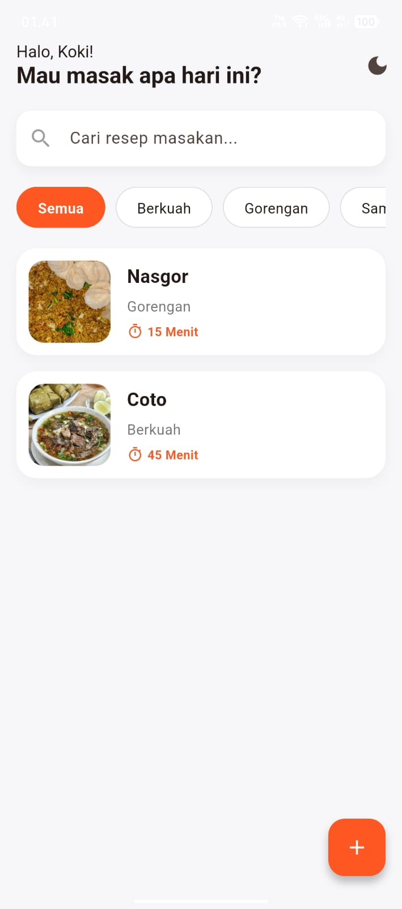

<h1 align="center">Aplikasi Resep Masakan Sederhana</h1>

<p align="center">
  Sebuah aplikasi mobile sederhana untuk mencatat, menyimpan, dan mengelola resep masakan favoritmu setiap hari. Dibangun menggunakan <b>Flutter</b>.
</p>

<p align="center">
  
  
  
</p>

---

## ✨ Fitur Utama

Aplikasi ini dilengkapi dengan berbagai fitur interaktif untuk memudahkan pengguna dalam mengelola resep:

* **📝 CRUD Resep (Create, Read, Update, Delete)**: Tambah resep baru, lihat detail, edit, dan hapus resep dengan mudah.
* **📸 Lampiran Foto (Opsional)**: Terintegrasi dengan galeri/kamera perangkat (Image Picker) untuk menambahkan visual masakan ke dalam resep.
* **🌓 Dark Mode & Light Mode**: Tampilan antarmuka yang adaptif dan nyaman di mata, bisa diganti kapan saja.
* **🔍 Pencarian (Search)**: Temukan resep masakan dengan cepat hanya dengan mengetikkan nama masakannya.
* **🗂️ Kategori Masakan**: Filter resep berdasarkan kategori (Semua, Berkuah, Gorengan, dll).
* **👆 Swipe-to-Action**: Cukup usap (swipe) kartu resep ke kiri untuk memunculkan aksi **Edit** atau **Hapus** dengan interaksi yang *smooth*.

---

## 🍕 Widget yang digunakan

### 1. Struktur Utama & Tema
* **MaterialApp:** Pondasi utama seluruh aplikasi. Di sinilah  mengatur nama aplikasi, warna dasar, dan tema (Terang/Gelap).

* **Scaffold:** Kerangka dasar sebuah halaman putih. Dia yang menyediakan tempat untuk AppBar (kepala halaman), body (isi halaman), dan floatingActionButton (tombol melayang).

* **ValueListenableBuilder**: Widget super yang kita pakai terakhir tadi. Fungsinya untuk mendengarkan perubahan (ketika tombol tema diklik) dan langsung me-refresh seluruh UI tanpa harus memuat ulang halaman.

### 2. Layout & Penataan Posisi
* **Column & Row:** Menyusun widget secara vertikal (atas ke bawah) dan horizontal (kiri ke kanan).

* **ListView & ListView.builder:** Membuat daftar yang bisa di-scroll. Kita pakai ini untuk deretan kategori dan daftar kartu resep di beranda.

* **Container:** Kotak serbaguna. Kita pakai untuk membuat latar belakang kartu resep, memberikan bayangan (shadow), dan lekukan sudut (border radius).

* **Expanded:** Memaksa suatu widget untuk mengisi seluruh sisa ruang kosong yang tersedia di layar (kita pakai agar daftar resep mengisi layar sampai bawah).

* **Padding & SizedBox:** Memberikan jarak atau spasi antar elemen agar tidak berdesakan.

* **Stack & Positioned:** Memungkinkan kita menumpuk widget. Kita menggunakan ini di Halaman Edit untuk menaruh ikon "pensil kecil" persis di atas pojok foto masakan.


### 3. Input & Tombol (Interaksi)
* **TextField & TextFormField:** Kotak tempat kamu mengetik pencarian, judul masakan, bahan, dan langkah-langkah.

* **DropdownButtonFormField:** Menu dropdown untuk memilih kategori ("Berkuah", "Gorengan", dll).

* **ElevatedButton:** Tombol utama yang menonjol (seperti tombol "Simpan Resep").

* **FloatingActionButton:** Tombol bundar melayang berikon + di pojok kanan bawah.

* **IconButton:** Ikon yang bisa diklik tanpa kotak latar (seperti ikon Matahari/Bulan di atas).

* **GestureDetector:** Widget transparan yang membuat area apa saja bisa diklik (kita pakai agar kotak foto bisa ditekan untuk membuka galeri, dan kategori bisa diklik).


### 4. Teks & Visual
* **Text & Icon:** Untuk menampilkan tulisan dan ikon bawaan.

* **Image.file:** Untuk menampilkan gambar asli yang diambil dari memori/galeri HP kamu.

* **ClipRRect:** "Gunting" khusus untuk memotong gambar. Gambar dari HP bentuknya kotak tajam, kita pakai ini agar sudut gambar fotonya ikut melengkung sesuai kotak Container.

* **CircleAvatar:** Membuat lingkaran sempurna. Kita jadikan latar belakang hitam transparan untuk ikon pensil di atas foto.


### 5. Widget Khusus (Animasi & Peringatan)
* **Slidable & SlidableAction:** Ini adalah widget dari package luar (flutter_slidable). Fungsinya untuk membuat efek geser (swipe) memunculkan tombol Edit dan Hapus.

* **SnackBar (via ScaffoldMessenger):** Pita notifikasi yang muncul dari bawah layar selama beberapa detik (seperti pemberitahuan "Resep berhasil disimpan" warna hijau atau merah).

---

## 📂 Struktur Direktori

Berikut adalah gambaran arsitektur dan struktur *folder* dari aplikasi ini yang dibuat dengan menggunakan paradigma OOP agar lebih terstruktur dan menghindari spaghetti code.

```text
lib/
├── database/
│   └── db_helper.dart      # Konfigurasi SQLite: Create, Read, Update, Delete ke database.
│
├── models/
│   └── resep.dart          # Data model untuk objek Resep (parsing dari/ke Map).
│
├── screens/
│   ├── detail_resep.dart   # Halaman untuk menampilkan info lengkap satu resep.
│   ├── edit_resep.dart     # Halaman form untuk mengubah data resep yang sudah ada.
│   └── tambah_resep.dart   # Halaman form untuk menginput resep baru.
│
├── widgets/
│   ├── kategori_chip.dart  # Komponen UI untuk pilihan kategori (Gorengan, Berkuah, dll).
│   └── resep_card.dart     # Komponen kartu resep di halaman utama dengan fitur swipe.
│
├── main.dart               # Entry point: Inisialisasi tema, database, dan Home Screen.
```
---

## 📱 Dokumentasi Program (Alur Aplikasi)


<br> Ini adalah Menu utama dari aplikasi ini dimana langsung muncul menu masakan lalu kategori, dan mencari masakan.
<br><br>

<br> Ini adalah tampilan dark mode dari aplikasi ini. Jika kita mengklik logo Bulan yang sebelumnya ada maka akan menjadi dark mode. dan untuk mengembalikan ke light mode cukup klik logo matahari di kanan atas.
<br><br>

<br> Klik logo + di kanan bawah maka akan ke tampilan tambah resep baru. Di sini kita wajib memasukan judul masakan, kategori, bahan-bahan dan langkah memasak. Untuk waktu memasak dan foto itu sifatnya opsional jadi tidak wajib diisi.
<br><br>

<br>Jika kita ingin memasukkan foto masakan maka aplikasi akan mengakses galeri kita. jadi kita bisa mengambil foto dari galeri untuk dimasukkan ke resep baru.
<br><br>

<br>Sudah ditulis semunanya tinggal klik "Simpan Resep" dan akan tersimpan
<br><br>

<br> Resep ote-ote yang tadi kita tambahkan sudah muncul di menu utama. di sini kita mau menghapus menu coto, caranya tinggal swipe ke kiri dan ada tombol edit dan hapus. klik tombol hapus maka menu akan terhapus

<br><br>

<br> Melihat resep ote-ote yang tadi ditambahkan tinggal klik saja resepnya dan akan muncul resep detailnya yang sudah kita tambahkan/buat tadi.
<br><br>

<br> Geser ke kiri dan akan muncul tombol edit, dan ini adalah fitur update atau edit resep.
<br>

<br> Di sini mencoba mengganti foto dari ote-ote, klk simpan berubahan.
<br>

<br>Terlihat bahwa foto ote ote berhasil berubah. dan fitur CRUD di aplikasi ini lengkap.

---


