# Resepku! - Mini Project 2

Aplikasi **Resepku** adalah platform manajemen resep masakan berbasis mobile yang dikembangkan menggunakan **Flutter**. Pada tahap Mini Project 2 ini, aplikasi telah ditingkatkan dengan integrasi **Cloud Backend (Supabase)** untuk penyimpanan data dan gambar secara real-time.

---

## 👤 Informasi Mahasiswa
* **Nama:** Ghendida Gantari Ayari
* **NIM:** 2409116080 B2024
* **Program Studi:** Sistem Informasi
* **Fakultas:** Teknik
* **Mata Kuliah:** Pemrograman Aplikasi Bergerak Praktikum
* **Instansi:** Universitas Mulawarman

---

## 🚀 Deskripsi Proyek
Melanjutkan pengembangan dari Mini Project 1, versi ini berfokus pada **integrasi database eksternal** dan **manajemen media**. Aplikasi tidak lagi menggunakan penyimpanan lokal, melainkan sudah terhubung sepenuhnya ke internet menggunakan layanan Supabase.

### 🛠️ Widget yang Digunakan
Aplikasi ini memanfaatkan berbagai widget Flutter untuk membangun UI yang responsif dan interaktif:
* **Layout:** `Scaffold`, `Column`, `Row`, `Expanded`, `SizedBox`.
* **List & Scroll:** `ListView.builder`, `SingleChildScrollView`.
* **Forms:** `TextFormField`, `DropdownButtonFormField`.
* **Interactivity:** `GestureDetector`, `InkWell`, `Slidable` (untuk fitur geser hapus/edit).
* **State Management & UI:** `StatefulWidget`, `ValueListenableBuilder` (untuk tema).

---

## Fitur Utama 
Untuk Fitur Tidak ada yang berubah dari minpro 1 hanya saja sekarang sudah terintegrasi dengan Supabase

1. **Full Cloud CRUD (Supabase Database):**
   - **Create:** Menambahkan resep baru ke tabel Supabase.
   - **Read:** Menampilkan daftar resep langsung dari cloud.
   - **Update:** Mengubah data resep yang sudah tersimpan.
   - **Delete:** Menghapus data dari database secara permanen.

2. **Cloud Storage (Supabase Bucket):**
   - Foto resep tidak disimpan di HP, melainkan di-upload ke **Supabase Storage**.
   - Saat resep dihapus, file foto di Storage juga ikut terhapus otomatis (Efisiensi Storage).

3. **Integrasi Media:**
   - Mendukung pengambilan foto masakan langsung dari **Kamera**.
   - Mendukung pemilihan foto dari **Galeri**.

4. **Dynamic Theme (Dark & Light Mode):**
   - Pengguna dapat mengganti tema aplikasi sesuai kenyamanan mata.

---

## Package / Dependencies
Daftar library utama yang digunakan dalam proyek ini:
* `supabase_flutter`: Koneksi ke backend database & storage.
* `image_picker`: Akses kamera dan galeri ponsel.
* `flutter_slidable`: Fitur geser pada list resep.
* `flutter_dotenv`: Keamanan API Key melalui file `.env`.
* `flutter_launcher_icons`: Kustomisasi ikon aplikasi.

---

## Dokumentasi Program (Alur Aplikasi)

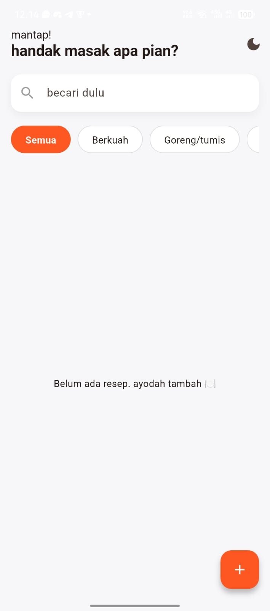
<br> Ini adalah Menu utama dari aplikasi ini dimana langsung muncul menu masakan lalu kategori, dan mencari masakan dan ini adalah versi light mode.
<br><br>
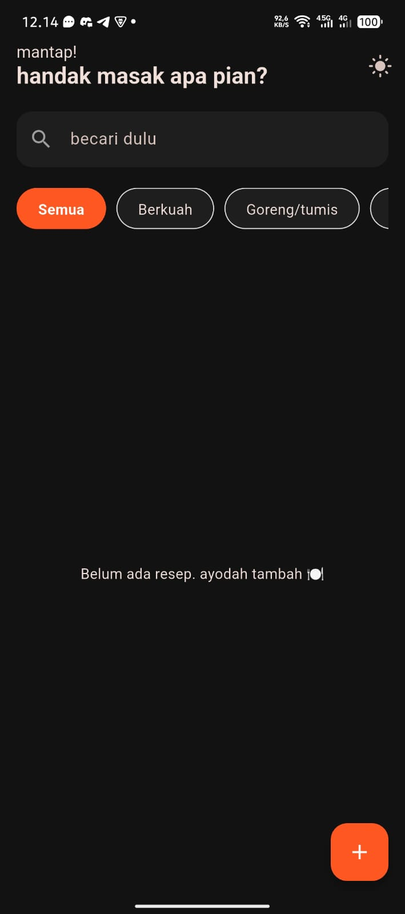
<br> Ini adalah tampilan dark mode dari aplikasi ini. Jika kita mengklik logo Bulan yang sebelumnya ada maka akan menjadi dark mode. dan untuk mengembalikan ke light mode cukup klik logo matahari di kanan atas.
<br><br>
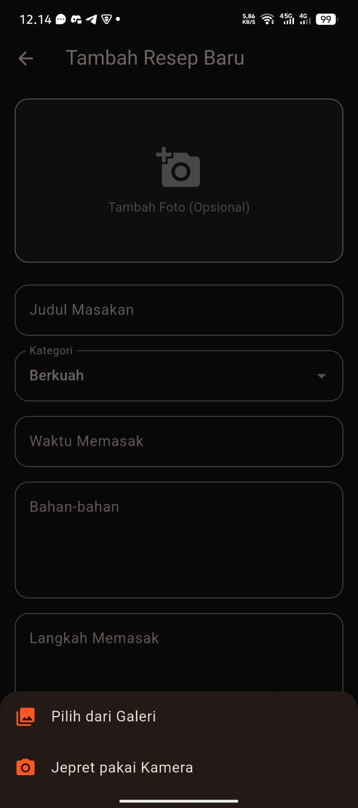
<br> Klik logo + di kanan bawah maka akan ke tampilan tambah resep baru. Di sini kita wajib memasukan judul masakan, kategori, bahan-bahan dan langkah memasak. Untuk waktu memasak dan foto itu sifatnya opsional jadi tidak wajib diisi. 
Jika kita mengklik bagian tambah foto maka akan muncul pilihan pilih dari galeri atau jepret pakai kamera.
<br><br>
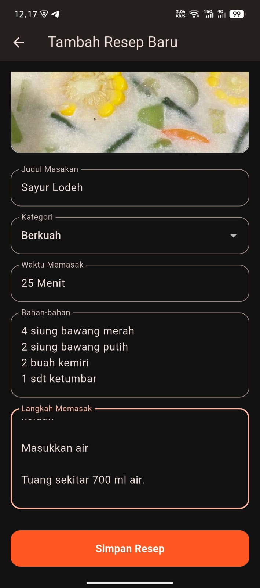
<br> Klik Simpan Resep
<br><br>
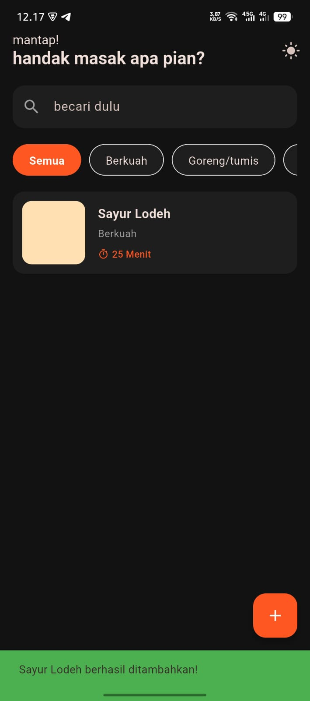
<br> Resep Sayur Lodeh yang ditambahkan tadi muncul di beranda
<br><br>
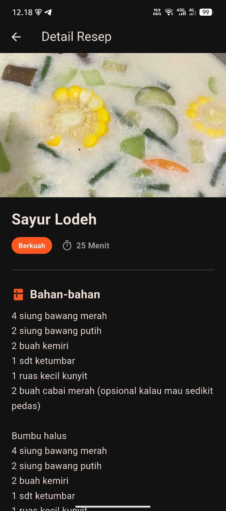
<br> Ini adalah tampilan untuk melihat detail resep dengan mengklik saja Sayur Lodeh
<br><br>
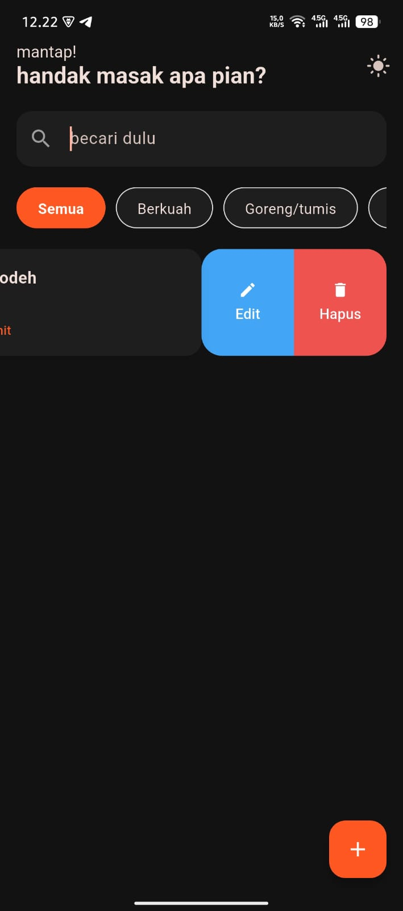
<br> Jika ingin melakukan edit resep atau hapus maka kita hanya perlu swipe/usap ke kiri agar muncul menu edit dan hapus
<br><br>
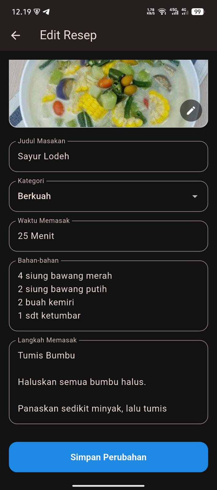
<br> Di sini saya melakukan edit dengan mengganti foto sayur lodeh dengan foto yang baru. jika saya mengganti foto baru maka foto lama akan terhapus di supabase dan akan tergantikan dengan foto baru, dengan catatan saya harus klik simpan perubahan
<br><br>
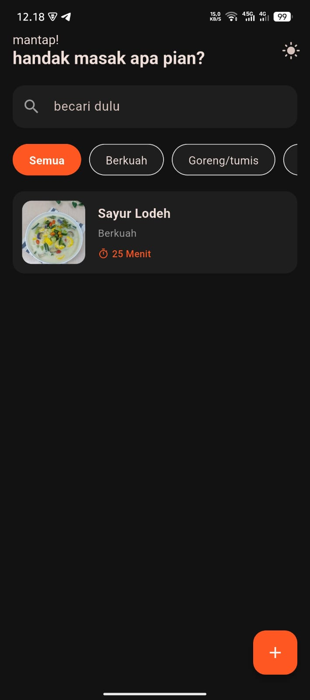
<br> Terlihat Fotonya berubah
<br><br>
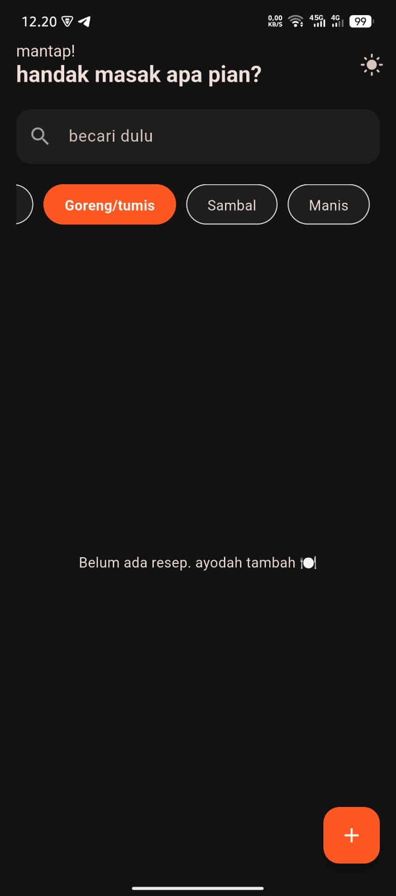
<br> Jika saya mengklik selain kuah maka kategori kuah tidak akan muncul
<br><br>
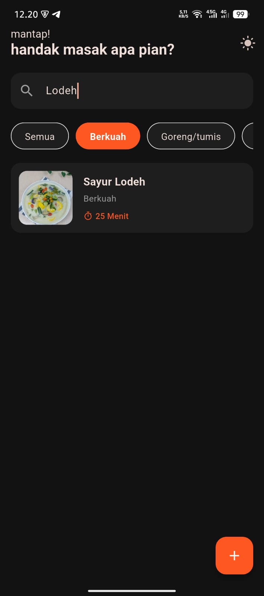
<br> Saya mengetik Lodeh dan hasilnya muncul Sayur Lodeh
<br><br>
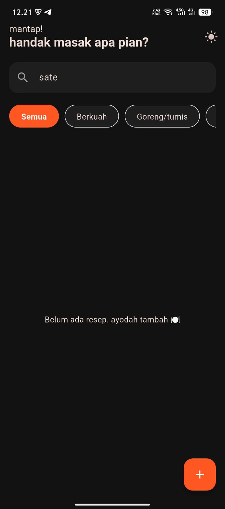
<br> Saya mengetik sate tidak muncul apa apa, karena saya belum ada menambahkan resep sate
<br><br>


---

## Cara Menjalankan Aplikasi

1. **Clone Repository:**
   ```bash
   git clone [https://github.com/GhenAyari/PabMinpro2.git](https://github.com/GhenAyari/PabMinpro2.git)